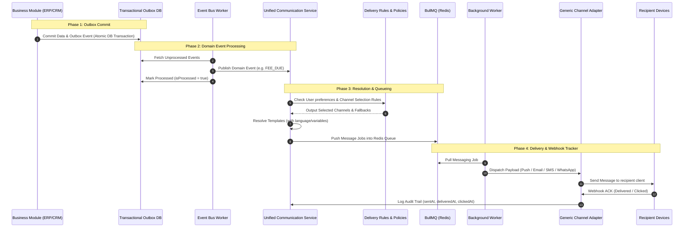

# ECP: Evolved Enterprise Communication Platform Blueprint

This document details the blueprint for an evolved **Enterprise Communication Platform (ECP)**, redesigned for long-term scalability, security, and multi-tenant isolation. It transitions from a push-only system to a generic, event-driven omni-channel messaging platform.

---

## 1. Updated Database Schema (Prisma)

The database schema is designed to represent communication domains polymorphically without locking tables to hardcoded entity relations (like `Guardian` or `Staff`). It models messages, recipients, dynamic channels, delivery status logs, templates, outbox queues, and device mappings:

```prisma
// ==========================================
// ECP Core Enums
// ==========================================

enum UserType {
  GUARDIAN
  STAFF
  ADMIN
  STUDENT
  DRIVER
  CUSTOMER
  VENDOR
}

enum ChannelType {
  PUSH
  EMAIL
  SMS
  WHATSAPP
  IN_APP
  VOICE
}

enum DeliveryStatus {
  PENDING
  QUEUED
  SENT
  DELIVERED
  FAILED
  CLICKED
  READ
  BOUNCED
  SKIPPED
}

enum NotificationPriority {
  LOW
  NORMAL
  HIGH
  EMERGENCY
}

enum TokenStatus {
  ACTIVE
  INVALID
  EXPIRED
  BLOCKED
}

enum PushPlatform {
  ANDROID
  IOS
  WEB
  WINDOWS
  MACOS
}

// ==========================================
// ECP Core Models
// ==========================================

// Represents the business-level message intent
model Message {
  id               String               @id @default(uuid())
  businessId       String               // Tenant identifier (multi-tenant boundary)
  campaignId       String?              // Optional: links message to a campaign
  templateId       String?              // Optional: links message to a versioned template
  subject          String?
  body             String?              @db.Text
  payload          Json?                // Custom structured parameters (deep-links, routing ids)
  priority         NotificationPriority @default(NORMAL)
  idempotencyKey   String               @unique // Guard against duplicate broadcast inputs
  scheduledFor     DateTime             @default(now())
  createdAt        DateTime             @default(now())

  campaign         Campaign?            @relation(fields: [campaignId], references: [id], onDelete: SetNull)
  template         MessageTemplate?     @relation(fields: [templateId], references: [id], onDelete: SetNull)
  recipients       MessageRecipient[]
  attachments      MessageAttachment[]

  @@index([businessId])
  @@index([scheduledFor])
}

// Links a Message to multiple polymorphic recipients
model MessageRecipient {
  id           String             @id @default(uuid())
  messageId    String
  recipientId  String             // Polymorphic Reference (Guardian ID, Staff ID, Customer ID, etc.)
  recipientType UserType
  email        String?            // Target email
  phone        String?            // Target phone (for SMS / WhatsApp / Voice)
  preferredLang String            @default("en")
  timezone     String             @default("UTC")
  createdAt    DateTime           @default(now())

  message      Message            @relation(fields: [messageId], references: [id], onDelete: Cascade)
  deliveries   MessageDelivery[]

  @@unique([messageId, recipientId, recipientType])
  @@index([recipientId, recipientType])
}

// Granular delivery log of a message to a recipient via a specific channel
model MessageDelivery {
  id               String           @id @default(uuid())
  recipientId      String           // Links back to MessageRecipient
  channel          ChannelType
  provider         String           // e.g. "FCM", "WEBPUSH", "SES", "TWILIO", "INFOBIP"
  destination      String           // Target email address, phone number, or device UUID
  deliveryStatus   DeliveryStatus   @default(PENDING)
  retryCount       Int              @default(0)
  sentAt           DateTime?
  deliveredAt      DateTime?
  clickedAt        DateTime?
  readAt           DateTime?
  providerResponse Json?            // Complete raw response payloads returned by vendors
  failureReason    String?          @db.Text
  createdAt        DateTime         @default(now())
  updatedAt        DateTime         @updatedAt

  recipient        MessageRecipient @relation(fields: [recipientId], references: [id], onDelete: Cascade)

  @@index([recipientId])
  @@index([deliveryStatus])
  @@index([channel])
}

// Devices registry ledger (decoupled from strict tables)
model PushDevice {
  id           String        @id @default(uuid())
  businessId   String
  userId       String        // Polymorphic reference (Guardian ID, Staff ID, etc.)
  userType     UserType
  deviceId     String        // Stable hardware signature hash
  pushToken    String        @unique @db.Text
  provider     String        // e.g. "FCM", "WEBPUSH", "ONESIGNAL"
  platform     PushPlatform
  browser      String?
  appVersion   String?
  osVersion    String?
  isActive     Boolean       @default(true)
  tokenStatus  TokenStatus   @default(ACTIVE)
  lastSeenAt   DateTime      @default(now())
  createdAt    DateTime      @default(now())
  updatedAt    DateTime      @updatedAt

  @@unique([businessId, deviceId])
  @@index([userId, userType])
}

// Message templates supporting placeholder interpolation, versioning, and localization
model MessageTemplate {
  id             String         @id @default(uuid())
  businessId     String
  code           String         // e.g., "FEE_DUE_REMINDER", "OTP_VERIFICATION"
  version        Int            @default(1)
  language       String         @default("en") // ISO code (en, hi, te, etc.)
  channel        ChannelType
  subject        String?        // Template subject placeholder
  body           String         @db.Text // Contains placeholder variables (e.g. {{ParentName}})
  htmlBody       String?        @db.Text // Optional html format template
  isActive       Boolean        @default(true)
  createdAt      DateTime       @default(now())
  updatedAt      DateTime       @updatedAt

  messages       Message[]

  @@unique([businessId, code, version, language, channel])
}

// Enterprise marketing and notice broadcast campaigns ledger
model Campaign {
  id             String         @id @default(uuid())
  businessId     String
  name           String
  description    String?        @db.Text
  audienceQuery  Json?          // Target selection rules metadata
  scheduledStart DateTime?
  isActive       Boolean        @default(true)
  createdAt      DateTime       @default(now())

  messages       Message[]

  @@index([businessId])
}

// Attachments metadata ledger (separate from body sizes)
model MessageAttachment {
  id             String         @id @default(uuid())
  messageId      String
  fileName       String
  fileSize       Int
  mimeType       String
  storageUrl     String         @db.Text
  createdAt      DateTime       @default(now())

  message        Message        @relation(fields: [messageId], references: [id], onDelete: Cascade)

  @@index([messageId])
}

// Per-user preference switches (controls delivery policies)
model UserCommunicationPreference {
  id               String       @id @default(uuid())
  businessId       String
  userId           String
  userType         UserType
  category         String       // e.g. "FINANCIAL", "ACADEMIC", "MARKETING"
  channel          ChannelType
  isEnabled        Boolean      @default(true)
  updatedAt        DateTime     @updatedAt

  @@unique([businessId, userId, userType, category, channel])
}

// Transactional Outbox pattern ledger (guarantees delivery durability)
model TransactionalOutbox {
  id             String         @id @default(uuid())
  businessId     String
  eventCode      String         // e.g., "ORDER_COMPLETED", "STUDENT_ABSENT"
  payload        Json           // Event metadata
  isProcessed    Boolean        @default(false)
  retryCount     Int            @default(0)
  errorMessage   String?        @db.Text
  createdAt      DateTime       @default(now())
  processedAt    DateTime?

  @@index([isProcessed])
  @@index([createdAt])
}
```

---

## 2. Platform Architecture & Data Flow



---

## 3. General Channel Provider Architecture

Business modules interact exclusively with the high-level `ChannelProvider` interfaces. The platform handles provider priority, automatic failover, and rate-limiting internally.

```typescript
// notifications/providers/ChannelProvider.ts

import { ChannelType, PushPlatform } from "@prisma/client";

export interface MessagePayload {
  recipientId: string;
  destination: string; // Phone, email, or device token
  subject?: string;
  body: string;
  htmlBody?: string;
  attachments?: Array<{ fileName: string; storageUrl: string }>;
  metadata?: Record<string, any>;
}

export interface ProviderResult {
  success: boolean;
  providerResponse: Record<string, any>;
  errorMessage?: string;
  isTransient?: boolean; // True if fail was a network glitch and safe to retry
}

export abstract class ChannelProvider {
  abstract getChannelType(): ChannelType;
  abstract getProviderName(): string;
  abstract send(payload: MessagePayload): Promise<ProviderResult>;
}
```

Example subclasses include `EmailProvider` (wrapping Hostinger/AWS SES), `PushProvider` (wrapping FCM/WebPush), `SMSProvider` (wrapping Twilio/Infobip), and `WhatsAppProvider` (wrapping WhatsApp Business API).

---

## 4. Scheduling, Policy & Rules Engines

The platform includes three distinct core engines:

### A. Scheduling Engine
Supports scheduling (e.g., immediate, delayed, recurring).
* Decouples delays using Redis delayed queues (`BullMQ` delayed options).
* Recurring triggers are evaluated by a daily cron script that populates the Transactional Outbox (e.g., checking due dates 3 days in advance and queueing messages).

### B. Delivery Rules Engine (Fallback Routing)
If a primary delivery channel fails, the platform executes a configurable routing fallback chain.
* **Flow**: `PUSH` (Immediate Alert) ──► If failed or offline ──► `WHATSAPP` ──► If failed ──► `SMS` ──► If failed ──► `EMAIL`.
* Rules are defined as JSON structures in database settings, requiring no code modifications.

### C. Communication Policy Engine
Evaluates structural priorities and safety rules before dispatching:
* **EMERGENCY Priority**: Ignores all user opt-out preferences and sends immediately over all available channels simultaneously.
* **MARKETING Priority**: Checked against `UserCommunicationPreference`. If disabled, it skips queue generation entirely.
* **Quiet Hours Gating**: Postpones non-critical alerts (e.g. general updates) between 10 PM and 7 AM, rescheduling jobs for the morning.

---

## 5. Security & Idempotency Model

### JWT & Identity Isolation
API endpoints extract `businessId` and `userId` from encrypted JWT cookie claims. Client requests cannot modify or supply recipient IDs, securing tenant data isolation.

### Rate-Limiting & Protection
* Heartbeat APIs are throttled using Redis sliding-window token bucket limiters.
* Multicast operations are throttled to ensure providers do not reject batches due to rate limits.

### Idempotency Guard
Every broadcast transaction requires an `idempotencyKey` (e.g., `invoice_id + term_name + attempt_count`). The API verifies if a matching key exists in the `Message` table before queueing to prevent duplicate payments alerts or SMS broadcasts.

---

## 6. Service Worker Responsibilities

The background Service Worker ([public/sw.js](file:///j:/virtue_fb/virtue-v2/public/sw.js)) handles background lifecycle events:

1. **`push`**: Parses metadata, collapses overlapping notification groups (e.g. grouping "Homework 1", "Homework 2" into "You have 2 new homework updates" if tags match), updates badge counts, and triggers delivery receipt logs.
2. **`notificationclick`**: Captures deep-link URLs, opens or focuses browser windows, and posts click analytical logs.
3. **`pushsubscriptionchange`**: Recover and refresh browser push subscription keys with the server when the browser rotates security tokens.

---

## 7. Unified Communication Timeline

By normalizing recipient deliveries, the platform provides a chronological timeline for customer support, auditing, and compliance:

```
[2026-07-15 10:00:00 AM] 📱 PUSH (FCM) -> Sent | Clicked: 10:05 AM (Fee Due Alert: Term 1)
[2026-07-15 10:05:00 AM] ✉️ EMAIL (SES) -> Sent | Opened: 11:20 AM (Detailed Invoice PDF Attachment)
[2026-07-16 02:00:00 PM] 💬 WHATSAPP (Meta) -> Sent | Delivered (Circular: School Annual Day Program)
```
This is populated by joining `Message`, `MessageRecipient`, and `MessageDelivery` records, providing a single source of truth for customer support.
