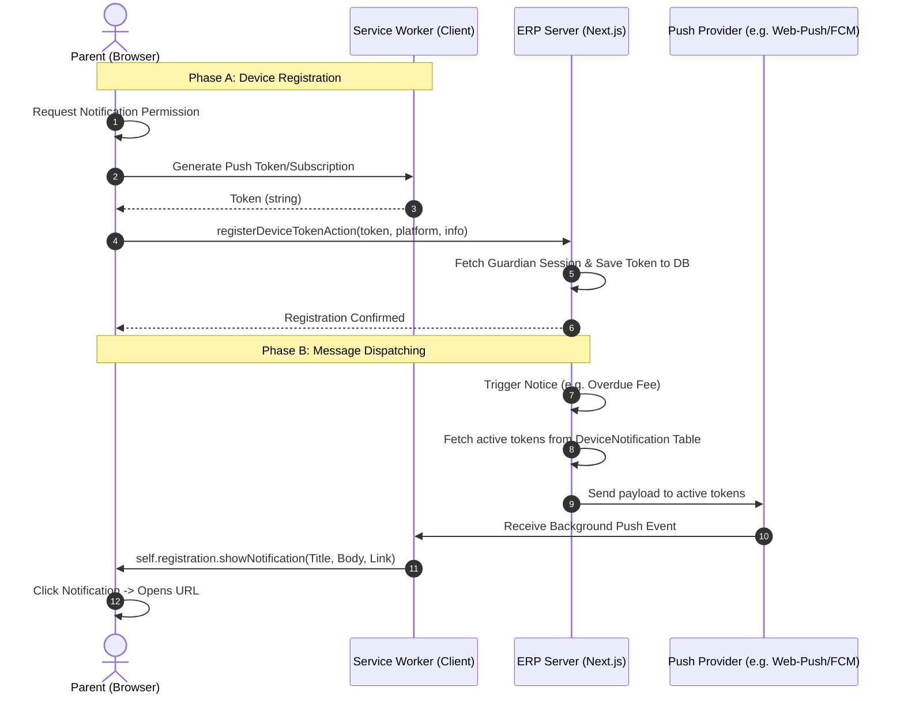

# Implementation Plan: Provider-Agnostic Push Notifications Architecture

This document details the blueprint for designing a complete push notification infrastructure (both sending from the server and receiving on client devices) for the parent and staff portals.

---

## 🏗️ 1. Database Schema Design

We need to persist device tokens linked to authenticated accounts. We'll introduce a `DeviceNotification` model in `prisma/schema.prisma` that supports multiple devices per user and works for both guardians and staff.

```prisma
// Represents registered devices for push notifications (Web Push, FCM, APNS, etc.)
model DeviceNotification {
  id          String   @id @default(uuid())
  schoolId    String
  guardianId  String?  // Linked if parent device
  staffId     String?  // Linked if staff/admin device
  token       String   @unique @db.Text // FCM token or Web-Push subscription string
  platform    String   // "WEB" | "ANDROID" | "IOS"
  deviceInfo  String?  // e.g. "Chrome/Windows", "Safari/iOS"
  isActive    Boolean  @default(true)
  createdAt   DateTime @default(now())
  updatedAt   DateTime @updatedAt

  guardian    Guardian? @relation(fields: [guardianId], references: [id], onDelete: Cascade)
  staff       Staff?    @relation(fields: [staffId], references: [id], onDelete: Cascade)
  school      School    @relation(fields: [schoolId], references: [id])

  @@index([guardianId])
  @@index([staffId])
  @@index([schoolId])
}
```

---

## 🔄 2. Architecture & Data Flow

Below is the workflow showing how push tokens are registered and how messages are pushed to target devices.



---

## 🛠️ 3. Backend Implementation (Server Actions)

We will define actions to register and manage device subscriptions safely:

### A. Register Token Action (`registerDeviceTokenAction`)
* **Purpose**: Saves or updates a device registration.
* **Logic**:
  1. Detects session role (Guardian or Staff).
  2. Parses the incoming payload (token, platform, deviceInfo).
  3. Uses `prismaBypass.deviceNotification.upsert` to record the token, linking it to the current user and their active tenant `schoolId`.

### B. Revoke Token Action (`unregisterDeviceTokenAction`)
* **Purpose**: Deletes a token from the database.
* **Logic**:
  1. Triggered on user logout or when they block notifications.
  2. Deletes matching records from `DeviceNotification`.

### C. Unified Dispatch Engine (`sendPushToUserAction`)
* **Purpose**: Dispatches pushes to all warded devices for a specific user ID.
* **Logic**:
  1. Resolves all active `DeviceNotification` records for the target user ID.
  2. Iterates and calls the configured provider driver (`FCM`, `Web-Push`, etc.) to transmit the notice payload.

---

## 📱 4. Client-side Implementation (Service Worker & Permission Registration)

To receive push messages, we must configure service worker hooks in Next.js:

### A. The Client Registry Hook (`usePushNotification.ts`)
* A React hook loaded on portal layout initialization:
  1. Checks if browser supports service workers and push notifications.
  2. Requests user approval: `Notification.requestPermission()`.
  3. Once accepted, registers service worker and extracts the subscription token.
  4. Dispatches token to `registerDeviceTokenAction`.

### B. Background Service Worker (`public/sw.js`)
* Standard service worker file residing in the `public/` directory:
  * **`push` event listener**:
    ```javascript
    self.addEventListener('push', function(event) {
      const data = event.data ? event.data.json() : { title: 'Notification', body: 'New alert received.' };
      event.waitUntil(
        self.registration.showNotification(data.title, {
          body: data.body,
          icon: '/favicon.ico',
          data: { url: data.url || '/parent/dashboard' }
        })
      );
    });
    ```
  * **`notificationclick` event listener**: Focuses or navigates the browser tab to the targeted link (e.g. `/parent/dashboard/fees`) when clicked.
