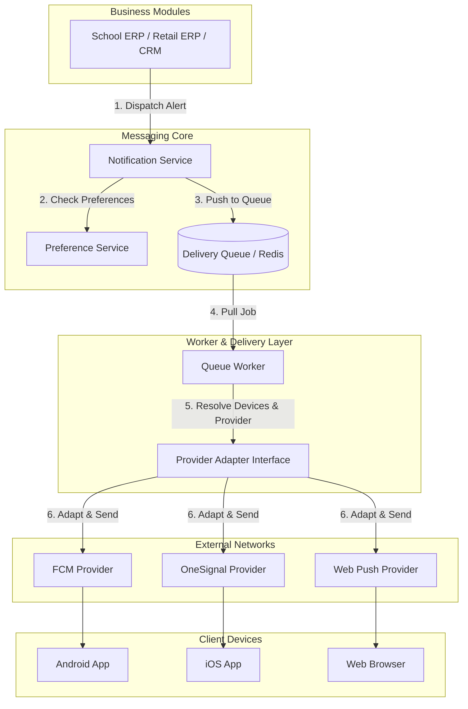
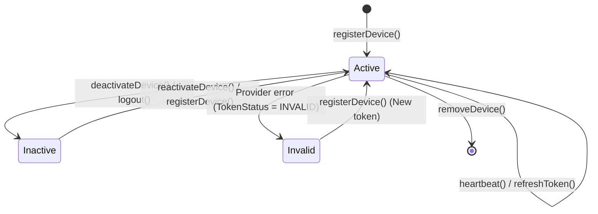
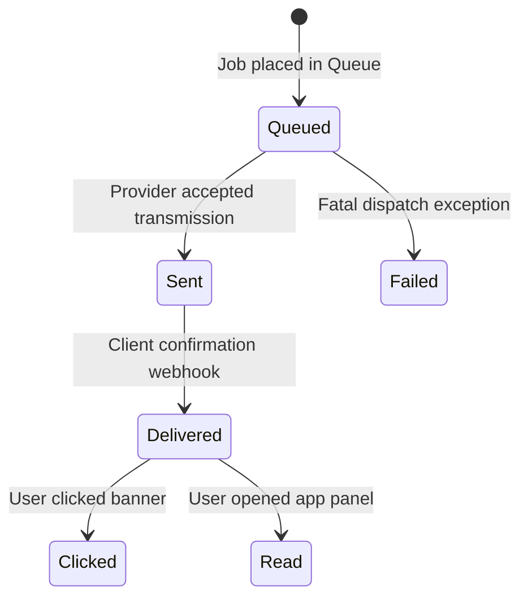

# Push Notification & Communication Platform: Enterprise Architecture Blueprint

This blueprint outlines the design of a highly scalable, multi-tenant, and provider-agnostic push notification and omni-channel messaging platform. The architecture is designed to support millions of devices across multiple enterprise products (School ERP, Retail ERP, CRM, HRMS, etc.) without vendor lock-in.

---

## 1. Enterprise Architecture Overview

### Critique of the Basic Approach
A simple client-to-server push architecture tightly couples the database models (e.g., hardcoded `Guardian` or `Staff` tables) to a specific push vendor (e.g., Firebase). This introduces significant limitations:
* **Vendor Lock-in**: Hard to switch from FCM to Web-Push or OneSignal without altering business logic.
* **Synchronous Bottlenecks**: Sending push notifications inline during HTTP requests increases latency and degrades API performance.
* **No Audit Trail**: Hard to track if notifications were actually delivered, clicked, or failed, making analytics impossible.
* **Tenancy & Product Isolation**: Incapable of scaling to multi-tenant or multi-product ERP environments.

### Redesigned Architecture
This architecture decouples the **Notification Trigger** (business logic) from the **Notification Delivery** (infrastructure) using an event-driven, queue-based pipeline.



---

## 2. Database Schema (Prisma)

Add the following models to [schema.prisma](file:///j:/virtue_fb/virtue-v2/prisma/schema.prisma) to define the schema. These models support multi-tenancy (`businessId`), extensible user roles (`userType`), and delivery auditing:

```prisma
// Enums for device and messaging parameters
enum UserType {
  GUARDIAN
  STAFF
  ADMIN
  STUDENT
  DRIVER
  CUSTOMER
  VENDOR
}

enum PushPlatform {
  ANDROID
  IOS
  WEB
  WINDOWS
  MACOS
}

enum TokenStatus {
  ACTIVE
  INVALID
  EXPIRED
  BLOCKED
}

enum NotificationType {
  PAYMENT_RECEIVED
  FEE_DUE
  ATTENDANCE
  ABSENT
  HOMEWORK
  EXAM_RESULT
  TRANSPORT
  CIRCULAR
  EMERGENCY
  GENERAL
}

enum DeliveryStatus {
  QUEUED
  SENT
  DELIVERED
  FAILED
  CLICKED
  READ
}

enum NotificationPriority {
  LOW
  NORMAL
  HIGH
  EMERGENCY
}

enum ChannelType {
  PUSH
  EMAIL
  SMS
  WHATSAPP
  IN_APP
}

// 1. Registered user devices ledger
model PushDevice {
  id           String        @id @default(uuid())
  businessId   String        // Multi-tenant isolation key (schoolId, tenantId, etc.)
  userId       String        // Polymorphic reference (Guardian ID, Staff ID, etc.)
  userType     UserType
  deviceId     String        // Stable, unique hardware fingerprint (UUID or client-generated hash)
  pushToken    String        @unique @db.Text
  provider     String        // e.g. "FCM", "WEBPUSH", "ONESIGNAL"
  platform     PushPlatform
  browser      String?       // "Chrome", "Safari", "Edge", etc.
  appVersion   String?
  osVersion    String?
  isActive     Boolean       @default(true)
  tokenStatus  TokenStatus   @default(ACTIVE)
  lastSeenAt   DateTime      @default(now())
  createdAt    DateTime      @default(now())
  updatedAt    DateTime      @updatedAt

  deliveries   NotificationDelivery[]

  @@unique([businessId, deviceId])
  @@index([userId, userType])
  @@index([businessId, userId])
}

// 2. Persistent notification registry
model Notification {
  id               String               @id @default(uuid())
  businessId       String
  title            String
  body             String               @db.Text
  notificationType NotificationType
  priority         NotificationPriority @default(NORMAL)
  payload          Json?                // Metadata (deep-links, routing info, parameters)
  createdAt        DateTime             @default(now())

  deliveries       NotificationDelivery[]

  @@index([businessId])
  @@index([notificationType])
}

// 3. Granular delivery audit log for analytical tracking
model NotificationDelivery {
  id             String         @id @default(uuid())
  notificationId String
  deviceId       String
  deliveryStatus DeliveryStatus @default(QUEUED)
  sentAt         DateTime?
  deliveredAt    DateTime?
  clickedAt      DateTime?
  readAt         DateTime?
  failureReason  String?        @db.Text
  retryCount     Int            @default(0)
  createdAt      DateTime       @default(now())
  updatedAt      DateTime       @updatedAt

  notification   Notification   @relation(fields: [notificationId], references: [id], onDelete: Cascade)
  device         PushDevice     @relation(fields: [deviceId], references: [id], onDelete: Cascade)

  @@index([notificationId])
  @@index([deviceId])
  @@index([deliveryStatus])
}

// 4. Per-user settings registry
model UserPreference {
  id               String           @id @default(uuid())
  businessId       String
  userId           String
  userType         UserType
  notificationType NotificationType
  channel          ChannelType
  isEnabled        Boolean          @default(true)
  updatedAt        DateTime         @updatedAt

  @@unique([businessId, userId, userType, notificationType, channel])
  @@index([businessId, userId, userType])
}
```

---

## 3. Database Indexing Recommendations

To support sub-second query speeds with millions of active rows:
1. **Compound Index `[userId, userType]`**: Used to quickly fetch all active devices for a parent or staff member when sending an alert.
2. **Tenancy Index `[businessId, userId]`**: Ensures strict data isolation, matching devices to the exact organization unit (multi-tenant boundary).
3. **Delivery Status Index `[deliveryStatus]`**: Optimizes background cleaning, retrying, and data purging routines.
4. **Unique Constraint `[businessId, deviceId]`**: Prevents registration conflicts when the same device ID updates or refreshes its token.

---

## 4. Provider Abstraction Layer

The system uses a provider-agnostic interface. The ERP core interacts only with the abstract classes, allowing new channels or networks (e.g. FCM, WebPush) to be plugged in dynamically:

```typescript
// notifications/providers/PushProvider.ts

import { PushPlatform } from "@prisma/client";

export interface PushPayload {
  title: string;
  body: string;
  payload?: Record<string, any>;
  priority?: "normal" | "high";
}

export interface MulticastResult {
  successCount: number;
  failureCount: number;
  invalidTokens: string[]; // List of tokens that must be marked invalid
  errors: Array<{ token: string; error: string }>;
}

export abstract class PushProvider {
  abstract getName(): string;
  
  abstract send(
    token: string,
    payload: PushPayload,
    platform: PushPlatform
  ): Promise<{ success: boolean; messageId?: string; error?: string }>;

  abstract sendMulticast(
    tokens: string[],
    payload: PushPayload,
    platforms: PushPlatform[]
  ): Promise<MulticastResult>;

  abstract validateToken(token: string): Promise<boolean>;
}
```

---

## 5. Queue Processing Flow

To scale API responses under heavy load, notifications are sent asynchronously through a background queue (e.g. BullMQ with Redis):

```
ERP Trigger Action
       │
       ▼
Add Job to Redis Queue (FIFO) ──► Immediate HTTP 202 Response to client
       │
       ▼
BullMQ Worker picks up Job
       │
       ├─► 1. Query user preferences (drop if disabled)
       ├─► 2. Query target devices from `PushDevice`
       ├─► 3. Log initial `NotificationDelivery` statuses as "QUEUED"
       │
       ▼
Worker resolves matching PushProvider (e.g. WebPush / Firebase)
       │
       ▼
Send payload in batches (multicast)
       │
       ├─► Success: Set status to "SENT"
       └─► Token Invalid Error: Trigger Device Deactivation (TokenStatus = INVALID)
```

---

## 6. Device Lifecycle

Devices navigate states to maximize delivery rates and minimize battery drain:



### Lifecycle APIs

#### A. `registerDevice(payload)`
* **Method**: `POST /api/notifications/devices/register`
* **Security**: Verified JWT required. `businessId` and `userId` are extracted from the token (never trust client-supplied input).
* **Behavior**: Upserts a record in `PushDevice` matching `[businessId, deviceId]`. If the device was previously marked `Inactive` or `Invalid`, it resets the state to `Active` and updates the token.

#### B. `refreshToken(payload)`
* **Method**: `POST /api/notifications/devices/refresh`
* **Behavior**: Updates the old token with a new token from the push provider. Marks status as `ACTIVE`.

#### C. `heartbeat(payload)`
* **Method**: `POST /api/notifications/devices/heartbeat`
* **Behavior**: Fired periodically by active clients to update `lastSeenAt`.

#### D. `deactivateDevice(payload)`
* **Method**: `POST /api/notifications/devices/deactivate`
* **Behavior**: Triggered during logouts. Marks `isActive = false`, preventing notifications from being dispatched to the device while keeping the audit history intact.

---

## 7. Notification Delivery Lifecycle

Every message transition is recorded in `NotificationDelivery` for audit logs:



---

## 8. Client Architecture

The client integration handles network and background changes:

```typescript
// notifications/hooks/usePushNotifications.ts

import { useEffect, useState } from "react";

export function usePushNotifications() {
  const [permission, setPermission] = useState<NotificationPermission>("default");
  const [subscription, setSubscription] = useState<any>(null);

  useEffect(() => {
    if (typeof window === "undefined" || !("serviceWorker" in navigator)) return;

    // 1. Monitor permission changes
    if ("permissions" in navigator) {
      navigator.permissions.query({ name: "notifications" }).then((status) => {
        status.onchange = () => setPermission(Notification.permission);
      });
    }

    // 2. Auto-recover subscriptions and heartbeat
    const interval = setInterval(() => {
      sendHeartbeat();
    }, 5 * 60 * 1000); // Fired every 5 minutes

    return () => clearInterval(interval);
  }, []);

  const requestPermission = async () => {
    const perm = await Notification.requestPermission();
    setPermission(perm);
    if (perm === "granted") {
      await registerServiceWorker();
    }
  };

  const registerServiceWorker = async () => {
    const reg = await navigator.serviceWorker.register("/sw.js");
    const sub = await reg.pushManager.subscribe({
      userVisibleOnly: true,
      applicationServerKey: "VAPID_PUBLIC_KEY"
    });
    setSubscription(sub);
    await syncDeviceWithServer(sub);
  };

  const syncDeviceWithServer = async (sub: any) => {
    await fetch("/api/notifications/devices/register", {
      method: "POST",
      body: JSON.stringify({
        token: JSON.stringify(sub),
        platform: "WEB",
        deviceId: await getUniqueDeviceFingerprint()
      })
    });
  };

  const sendHeartbeat = async () => {
    await fetch("/api/notifications/devices/heartbeat", { method: "POST" });
  };

  return { permission, requestPermission, subscription };
}

async function getUniqueDeviceFingerprint(): Promise<string> {
  // Uses browser storage or UUID to keep a persistent local fingerprint
  let id = localStorage.getItem("device_fingerprint");
  if (!id) {
    id = crypto.randomUUID();
    localStorage.setItem("device_fingerprint", id);
  }
  return id;
}
```

---

## 9. Background Service Worker responsibilities

The Service Worker ([public/sw.js](file:///j:/virtue_fb/virtue-v2/public/sw.js)) runs in a background thread to handle browser-closed push events and handle interactions:

```javascript
// public/sw.js

// 1. Handle incoming background pushes
self.addEventListener("push", function (event) {
  if (!event.data) return;

  try {
    const payload = event.data.json();
    const options = {
      body: payload.body,
      icon: payload.icon || "/icons/icon-192x192.png",
      badge: payload.badge || "/icons/badge-72x72.png",
      image: payload.image || null,
      data: {
        url: payload.url || "/parent/dashboard",
        deliveryId: payload.deliveryId
      },
      actions: payload.actions || [], // Supporting deep-links or quick actions
      tag: payload.tag || "default-tag", // Collapses matching message cards
      renotify: true
    };

    event.waitUntil(
      Promise.all([
        self.registration.showNotification(payload.title, options),
        updateBadgeCount(payload.unreadCount),
        logDeliveryReceipt(payload.deliveryId, "DELIVERED")
      ])
    );
  } catch (err) {
    console.error("SW Push Parsing Error:", err);
  }
});

// 2. Handle user click on banner
self.addEventListener("notificationclick", function (event) {
  event.notification.close();
  const urlToOpen = event.notification.data?.url || "/parent/dashboard";
  const deliveryId = event.notification.data?.deliveryId;

  event.waitUntil(
    Promise.all([
      // Track Click Analytics
      logDeliveryReceipt(deliveryId, "CLICKED"),
      // Open / Focus target tab
      clients.matchAll({ type: "window", includeUncontrolled: true }).then((windowClients) => {
        for (let client of windowClients) {
          if (client.url === urlToOpen && "focus" in client) {
            return client.focus();
          }
        }
        if (clients.openWindow) {
          return clients.openWindow(urlToOpen);
        }
      })
    ])
  );
});

// 3. Handle notification dismiss
self.addEventListener("notificationclose", function (event) {
  const deliveryId = event.notification.data?.deliveryId;
  if (deliveryId) {
    event.waitUntil(logDeliveryReceipt(deliveryId, "DISMISSED"));
  }
});

// Helper: Post status update webhooks to server
async function logDeliveryReceipt(deliveryId, status) {
  if (!deliveryId) return;
  try {
    await fetch("/api/notifications/analytics", {
      method: "POST",
      headers: { "Content-Type": "application/json" },
      body: JSON.stringify({ deliveryId, status })
    });
  } catch (err) {
    console.error("SW Analytics Webhook Failed:", err);
  }
}

// Helper: Update badge counts on device icons
async function updateBadgeCount(count) {
  if ("setAppBadge" in navigator) {
    if (count > 0) {
      await navigator.setAppBadge(count);
    } else {
      await navigator.clearAppBadge();
    }
  }
}
```

---

## 10. Security Model

* **JWT Verification**: Device registration relies on server-side token checks. Client-provided user IDs are never trusted.
* **Tenant Isolation**: Queries select by `businessId` to prevent users from accessing notifications across different organizations.
* **Rate Limiting**: Devices are restricted to a maximum of 3 heartbeat requests every 5 minutes to prevent battery drain and API spam.
* **Device Deactivation**: Tokens are deactivated (rather than hard-deleted) on logouts. This preserves the delivery audit history for analytics.

---

## 11. Scheduled Cleanup Jobs (Cron Workers)

To maintain database performance over time, daily background tasks run the following database cleanup steps:

1. **Delete Dead Tokens**: Deletes all `PushDevice` records where `tokenStatus = INVALID` and `lastSeenAt < Date.now() - 30 days`.
2. **Archiving History**: Copies `NotificationDelivery` logs older than 90 days to a cold-storage analytical archive database to keep the active PostgreSQL indexes small.
3. **Transient Retry Handler**: Queries queued jobs that failed due to temporary network errors and re-adds them to the worker queue with an exponential backoff retry rule.

---

## 12. Scalability to Millions of Devices

* **Connection Pool Management**: Redis manages the queue to ensure Next.js API processes can return immediate HTTP responses without getting blocked by network delays from external push providers.
* **Multicast Batching**: Adapters divide list payloads into groups of 500 (FCM limits) to utilize multicast pipelines instead of calling single-instance HTTP endpoints.
* **Database Partitioning**: The `NotificationDelivery` table can be partitioned monthly by the `createdAt` timestamp, keeping indexes small and query speeds fast.

---

## 13. Extensibility to Omni-channel Communications

This design is easily extensible to other communication channels like **Email, SMS, WhatsApp, and In-App notifications**:

```
                              Notification Request
                                       │
                                       ▼
                       NotificationService.dispatch()
                                       │
       ┌───────────────────────────────┼───────────────────────────────┐
       ▼                               ▼                               ▼
 [Push Channel]                 [SMS Channel]                   [Email Channel]
       │                               │                               │
       ▼                               ▼                               ▼
PushDevice registry             SMS Gateway Adapter             SMTP/SES Adapter
       │                               │                               │
       ▼                               ▼                               ▼
Background Queue Worker        Background Queue Worker        Background Queue Worker
```

By mapping the `ChannelType` enum, we can easily extend the platform:
1. **Queueing**: Send email, WhatsApp, and SMS jobs to the same Redis/BullMQ instances.
2. **Preference Checks**: Checks `UserPreference` to verify if the recipient prefers WhatsApp, Email, or Push notifications for a given message type before sending.
3. **Unified Delivery Log**: Log all notifications in `NotificationDelivery`. This allows you to track analytics (such as read rates, click rates, and delivery success) across all channels from a single dashboard.
