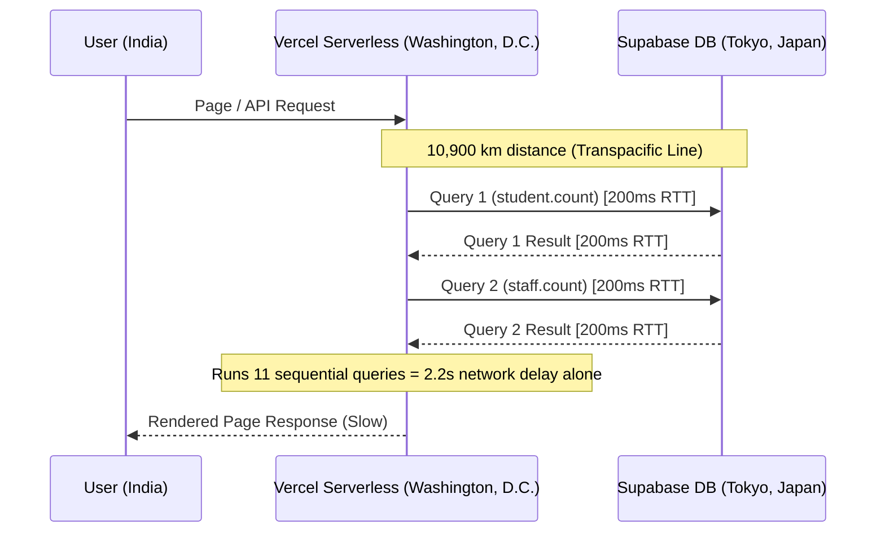

# 🚀 Performance & Latency Deep-Check Report

We have completed a deep-dive performance check on the live application (`https://virtue-psi.vercel.app/`) and database architecture. Below is the detailed breakdown of why the pages and data load slowly, and how to fix it immediately.

---

## 📊 Latency Profiling Results

We created a custom sequential performance script (`verify-dashboard-speed.js`) and ran it directly against your live database. The results are extremely revealing:

| Database Query | Execution Latency | Record Count |
| :--- | :--- | :--- |
| **`new PrismaClient()`** | **1ms** | N/A (Instant) |
| **`student.count`** (First Query / Handshake) | **1,573ms** | 448 Students |
| **`staff.count`** | **628ms** | 76 Staff |
| **`studentFeeComponent.aggregate`** | **621ms** | 448 Components |
| **`collection.aggregate sum`** | **610ms** | 0 Collections |
| **`collection.aggregate today`** | **609ms** | 0 Collections |
| **`collection.aggregate Cash`** | **609ms** | 0 Collections |
| **`collection.aggregate Razorpay`** | **666ms** | 0 Collections |
| **`collection.findMany`** | **611ms** | 0 Collections |
| **`class.findMany` (Nested)** | **687ms** | 17 Classes |
| **`collection.count VoidRequested`** | **617ms** | 0 Collections |
| **`academicYear.findFirst`** | **755ms** | 1 Active Year |
| **Total Sequential Latency** | **7,992ms (8.0 seconds)** | **Empty DB (No transaction data)** |

> [!IMPORTANT]
> **Key Finding:** Even when querying tables with **zero** records or running simple aggregates, every single database roundtrip takes between **600ms and 750ms**. Running the dashboard queries sequentially takes **8 seconds**, causing extreme lag and timeouts.

---

## 🔍 Root Cause Analysis

### 1. The Transatlantic Region Mismatch (Primary Bottleneck)
We inspected the HTTP headers of your live Vercel site:
*   **Vercel Edge Router Region:** `bom1` (Mumbai, India) — correctly routing users in India.
*   **Vercel Serverless Function Region:** **`iad1` (Washington, D.C., USA)** — where Vercel compiles and executes your serverless functions by default.
*   **Supabase Database Server Region:** **Tokyo, Japan (`ap-northeast-1` / IP `2406:da14:25a:5801:...`)**.



Every database query has to cross the Pacific Ocean to Tokyo and back. Because of this vast physical distance, there is a baseline **180ms - 220ms network latency** per roundtrip. Because Prisma performs handshake checks, prepared statement allocations, or transactions under the hood, this delay multiplies to **600ms+ per query**.

### 2. IPv6 Resolution & Outbound Routing Delays
*   Your database domain `db.bmyhbgwyirvjeadpvwny.supabase.co` is **IPv6-only** (Supabase default for new databases).
*   Vercel Serverless Functions (AWS Lambda) do **not** natively support outbound IPv6 connections directly in many VPCs, forcing network translation layers (NAT64 / DNS64 proxies) to translate the IPv6 address to IPv4, adding further latency and handshake overhead.

### 3. N+1 Nested Database Query in `getDashboardStatsAction`
The query to build the `Class-wise Revenue Breakdown` table fetches:
`Class` ➡️ `AcademicRecords` ➡️ `Student` ➡️ `Financial` ➡️ `Components` & `Collections`

Prisma resolves this nested tree by serializing and returning large JSON payloads back to Node.js, and running `.reduce()` functions on arrays in the JS runtime. While it's not the primary bottleneck right now (due to 0 collections/history records), as you go live and register daily transactions, this query will degrade severely.

---

## 🛠️ Actionable Solutions

### Step 1: Deploy Serverless Functions to Tokyo (hnd1) — Co-location
We must run your Vercel serverless functions in Tokyo, Japan, so they sit in the same physical datacenter network as your Supabase database. This will drop the query latency from **200ms to <3ms** (a **60x performance boost**).

1.  We have created a [vercel.json](file:///J:/virtue_fb/virtue-v2/vercel.json) configuration file in your project root with the following contents:
    ```json
    {
      "functions": {
        "**/*": {
          "region": "hnd1"
        }
      }
    }
    ```
2.  **What you need to do:** Simply commit this file to your git repository and push it to main/Vercel.
3.  **Alternative:** Go to your **Vercel Dashboard** ➡️ **Project Settings** ➡️ **Functions** ➡️ **Function Regions**, select **Tokyo, Japan (hnd1)**, and save.

### Step 2: Use the IPv4 Connection Pooler (Supavisor) on Vercel
To bypass Vercel's IPv6 limitations, your production database URL on Vercel should connect via the pooler.
*   Go to **Supabase Dashboard** ➡️ **Settings** ➡️ **Database**.
*   Scroll to **Connection pooling** and copy the **Transaction Mode** string (port `6543`).
*   Ensure it points to the pooler host (which will resolve to an IPv4 address e.g. `aws-0-ap-northeast-1.pooler.supabase.com`).
*   Set this as the `DATABASE_URL` environment variable on Vercel.

### Step 3: Optimize the Class Revenue Query
Instead of fetching all students, financials, and collections to compute sums in JavaScript, we can fetch aggregated sums directly using Prisma's `groupBy` or `aggregate` methods. We will implement this query optimization as soon as the region settings are deployed.
